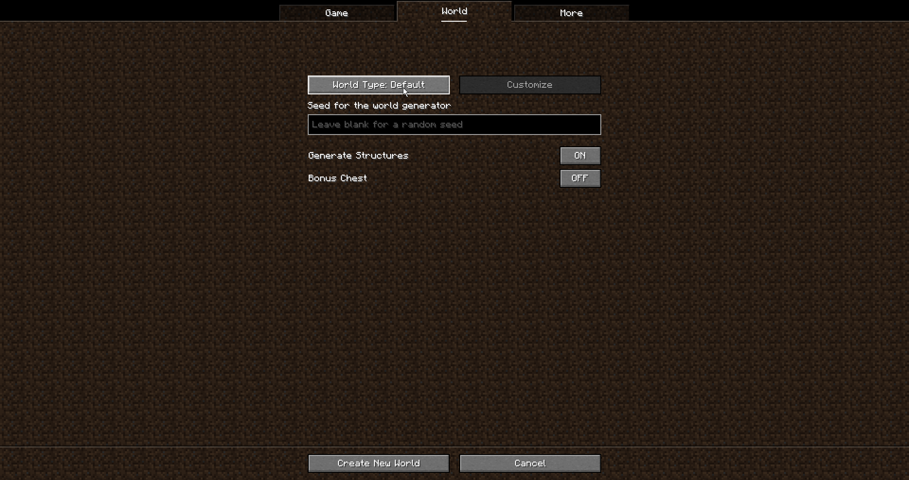

# Adding custom world presets
If your mod completely overhauls Minecraft's worldgen, you'll want to create a custom worldtype so you give people the option to use your worldgen or MC's vanilla worldgen.
Now, what is a custom worldtype you may ask? A custom worldtype is what will show up here: 
To add your custom world preset(s), you have to navigate to your mod/datapack's `resources/data` folder.

Make a file titled `example_mod_preset.json` in `../example_mod/worldgen/world_preset` and populate it with the following:
```json
{
  "dimensions": {
    "minecraft:overworld": {
      "type": "minecraft:overworld",
      "generator": {
        "type": "minecraft:noise",
        "biome_source": {
          "type": "minecraft:multi_noise",
          "preset": "minecraft:overworld"
        },
        "settings": "example_mod:example_mod_noise"
      }
    }
  }
}
```
- `"dimensions`: The dimension(s) in your custom world preset. It is recommended to have at least `"minecraft:overworld"`, `"minecraft:nether"`, and `"minecraft:the_end"`.
- `"minecraft:overworld"`: This is required, otherwise your world preset will not work.
- `"type"`: The namespace ID for the dimension you're using.
- `"generator"`: Various settings to tell Minecraft how to generate the terrain found in this dimension.
- `"settings"`: What perlin noise to use for worldgen in this dimension.


Make a file titled `normal.json` in `../minecraft/tags/worldgen/world_preset` and populate it with the following:
This will tell Minecraft to show your world preset when you go to create a new world.
```json
{
  "values": [
    "wonders:wonders"
  ]
}
```
